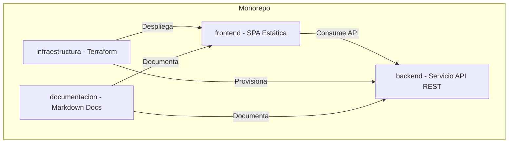

# 🏗️ Arquitectura de la Solución Monorepo

Este documento describe la arquitectura modular del monorepo y cómo se relacionan los diferentes componentes que lo integran.

## Diseño Modular
El monorepo está diseñado bajo una estrategia de desacoplamiento de componentes, permitiendo que cada directorio funcione de manera independiente mientras comparten políticas globales de despliegue.

## Componentes
1. **Frontend**: Aplicación SPA (Single Page Application) ligera. Compila sus archivos estáticos de producción en una carpeta `/dist` para ser expuesta por un CDN o servidor web.
2. **Backend**: API de microservicio implementada con los estándares nativos de Node.js. Responde a peticiones HTTP JSON y corre de forma independiente en contenedores o máquinas virtuales.
3. **Infraestructura**: Declaración de infraestructura como código (IaC) con Terraform para provisionar y configurar los recursos cloud del Frontend y Backend.
4. **Documentación**: Contratos de API, guías de instalación y modelos arquitectónicos del sistema.

---

## Flujo de Integración Continua (CI/CD)
El orquestador de CI/CD evalúa en cada commit qué componentes han cambiado y ejecuta únicamente las pruebas del componente modificado.
Si solo se actualizan guías de documentación en esta carpeta `documentacion/`, los runners pesados de desarrollo de software se desactivan automáticamente para optimizar los tiempos de ejecución.
