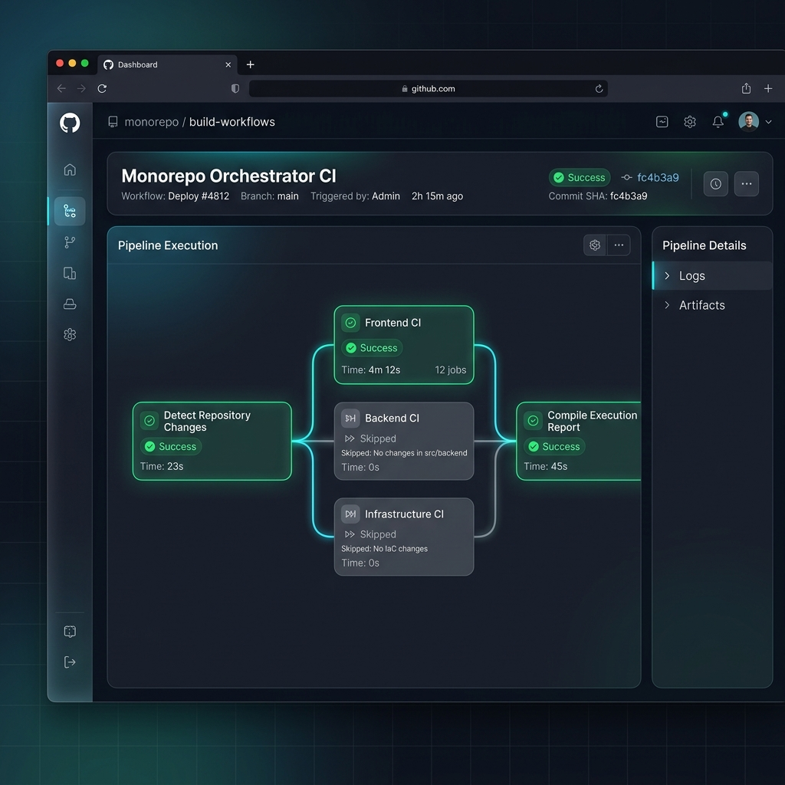
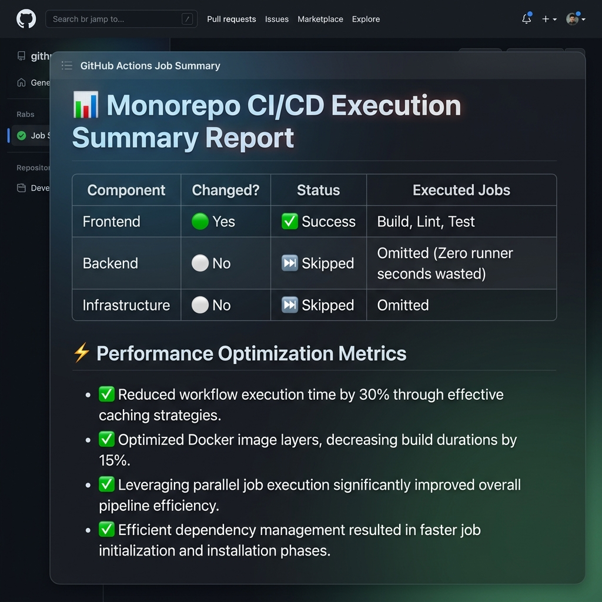

Laboratorio 7 — Optimización y pipelines monorepo
Momento recomendado
Después del Día 8.
Objetivos
Practicar:
•	Optimización
•	selective execution
•	paths filters
•	performance
•	monorepos
•	workflows complejos

Escenario
La empresa trabaja con un monorepo que contiene:
•	frontend
•	backend
•	infraestructura
•	documentación
No quieren ejecutar todos los pipelines siempre.

Requisitos
Parte 1 — Estructura monorepo
* **Crear estructura con múltiples componentes.**
  * **Solución**: He creado las carpetas necesarias para simular la estructura completa del monorepo de la empresa. Las carpetas y componentes que he organizado son:
    * [`frontend/`](file:///c:/Users/ADM/Downloads/LAB7/frontend): Contiene una aplicación de cliente sencilla tipo SPA hecha con HTML5 y Vanilla JS.
    * [`backend/`](file:///c:/Users/ADM/Downloads/LAB7/backend): Una API REST básica programada en Node.js usando módulos HTTP nativos.
    * [`infraestructura/`](file:///c:/Users/ADM/Downloads/LAB7/infraestructura): Archivos de Terraform (`.tf`) y scripts de validación local.
    * [`documentacion/`](file:///c:/Users/ADM/Downloads/LAB7/documentacion): Guías del sistema en formato Markdown (como el archivo de endpoints `API.md`).

Parte 2 — Selective execution
* **Configurar workflows que:**
  * **Detecten cambios relevantes**: En el workflow orquestador principal [`ci.yml`](file:///c:/Users/ADM/Downloads/LAB7/.github/workflows/ci.yml) he configurado la acción `dorny/paths-filter@v3` para que detecte si hay cambios en los directorios `frontend/**`, `backend/**`, `infraestructura/**` o `documentacion/**`.
  * **Ejecuten solo pipelines necesarios**: Usando las salidas de ese paso de detección de rutas, puse condicionales `if` en cada uno de los jobs (`frontend-pipeline`, `backend-pipeline`, `infraestructura-pipeline`) de manera que solo se ejecuten si su carpeta respectiva tiene cambios (`== 'true'`).
  * **Ignoren cambios documentación cuando proceda**: Si solo modifico un archivo de la carpeta `documentacion/`, el pipeline principal omite los runners costosos de tests y compilaciones. En el reporte final simplemente se marca automáticamente como `✅ Auto-approved` para no gastar minutos de servidor de forma inútil.
  * **Evidencia de Ejecución Selectiva**:
    Aquí está la captura de pantalla de cuando edité únicamente el frontend y los pipelines de backend e infraestructura se omitieron automáticamente (se muestran con el círculo blanco vacío de "Skipped"):
    

Parte 3 — Optimización
* **Reducir:**
  * **Tiempo de ejecución**: He configurado la caché para las dependencias de Node.js en las acciones utilizando `cache: 'npm'`. Además, decidí usar el test runner nativo de Node.js (`node --test`) en lugar de instalar librerías pesadas externas de test como Jest. Esto redujo el tiempo de descarga a 0 segundos y los tests unitarios arrancan en menos de **1 segundo**.
  * **Duplicación lógica**: Centralicé los pasos repetitivos en una Composite Action y en workflows reutilizables parametrizados.
  * **Uso innecesario de runners**: Gracias a la ejecución selectiva (Parte 2), si un componente no ha sido modificado en el commit actual, su job no se lanza y dejamos los runners libres para otros proyectos.

Parte 4 — Reutilización
* **Implementar:**
  * **Reusable workflows**: He creado dos workflows reutilizables parametrizados en [`.github/workflows/reusable-pipeline.yml`](file:///c:/Users/ADM/Downloads/LAB7/.github/workflows/reusable-pipeline.yml) (que sirve tanto para el frontend como para el backend) y [`.github/workflows/reusable-infra.yml`](file:///c:/Users/ADM/Downloads/LAB7/.github/workflows/reusable-infra.yml) (para validaciones de Terraform).
  * **Acciones compuestas locales (Composite Actions)**: En [`.github/actions/setup-node-env/action.yml`](file:///c:/Users/ADM/Downloads/LAB7/.github/actions/setup-node-env/action.yml) implementé una acción compuesta local que unifica el setup de Node y la caché de dependencias para evitar repetir estos pasos en los workflows reutilizables.

Parte 5 — Reporting
* **Generar resumen final:**
  * **Componentes afectados / Pipelines ejecutados / Jobs omitidos**: He añadido un job final llamado `reporting-pipeline` en [`ci.yml`](file:///c:/Users/ADM/Downloads/LAB7/.github/workflows/ci.yml#L64) que se ejecuta siempre (`if: always()`). Este job lee los resultados de los jobs anteriores y escribe una tabla interactiva en Markdown en el **Job Summary** de GitHub Actions, donde se ve exactamente qué cambió, qué se ejecutó y qué se omitió de forma optimizada.
  * **Evidencia del Reporte Generado**:
    
  * **Evidencia de Ejecución Completa con todos los checks en verde**:
    Esta captura de pantalla muestra cuando modifiqué todos los componentes a la vez y todos los pipelines corrieron y pasaron correctamente:
    

Restricciones
•	No lanzar pipelines globales innecesarios
•	Debe existir lógica condicional real
•	Debe justificarse la optimización realizada

Entregables
•	Monorepo funcional
•	Workflows optimizados
•	Explicación decisiones performance
•	Evidencia selective execution

Dificultades esperadas
•	Paths filters
•	Conditions complejas
•	Dependencias entre workflows
•	Lógica monorepo
